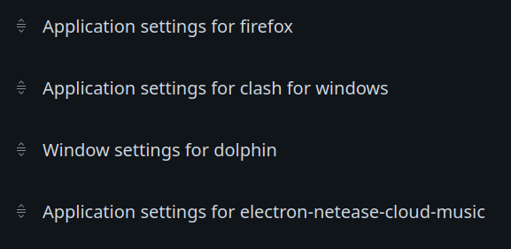
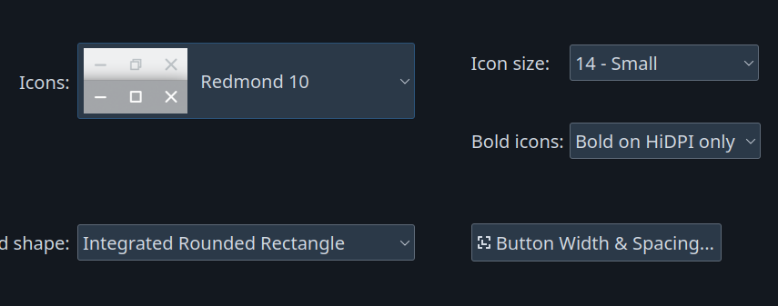

# Arch Linux Installation

## 1. Install the Basic System

### 1.1 Create USB Booter

Use Ventoy: Just put the iso in the larger folder (not EFI folder)

### 1.2 Ventoy Boot

It seems like arch needs to be booted in grub mod in ventoy

### 1.3 Connect to the network

It only provides iwctl by default <br/>

- For WPA2-Enterprise, you have to have Certificate
- Choose Hotspot instead
  - `device list`
  - `station device scan`
  - `station device get-networks`
  - `station device connect SSID`

### 1.4 Partition

1. Check the Partitions
   `lsblk -l` or `fdisk -l`

2. Use cfdisk to set partition
   `cfdisk /dev/[hardrive name]`

- 4 basic partitions: EFI, root, home, swap
  - EFI: 512M, EFI type
  - root/home: Linux FileSystem
  - swap: Linux Swap
- new, set size, set type, write

3. Format
   `mkfs.ext4 /dev/[root or home disk name]`
   `mkfs.fat -F 32 /dev/[EFI]`
   `mkswap /dev/[swap]`

4. Mount to /mnt for the installation

- `mount /dev/[root] /mnt` this should be done firstly
- `mount --mkdir /dev/[EFI] /mnt/boot`
- `mount --mkdir /dev/[home] /mnt/home`
- `swapon /dev/[swap]`

### 1.5 Begin to install

`pacstrap -K /mnt base linux linux-firmware base-devel`

### 1.6 fstab

`genfstab -U /mnt >> /mnt/etc/fstab`

### 1.7 Configure the new system

1. `arch-chroot /mnt`
2. Time zone and Time
   - `ln -sf /usr/share/zoneinfo/Asia/Shanghai /etc/localtime`
   - `hwclock --systohc` correct the time
3. Get to /etc
4. Set locale

   - vim locale.gen: find <br/>

   ```
   en_US.UTF-8 UTF-8
   zh_CN.UTF-8 UTF-8
   zh_TW.UTF-8 UTF-8
   ```

   `locale-gen` load configuration

   - vim locale.conf <br/>

   ```
   LANG=en_US.UTF-8 UTF-8
   ```

   - Install Chinese font
     - noto-fonts-cjk
     - wqy-microhei
     - adobe-source-han-serif-cn-fonts
     - adobe-source-han-sans-cn-fonts
       ...

5. Accounts

- `passwd`: set password for root
- `useradd -m [yourname]`
- `passwd [yourname]`
- `vim sudoers`: write `ALL=(ALL) ALL` under root
- `vim hostname`: write your name in the file

These files are all under /etc

6. Boot configurations

- `pacman -S grub efibootmgr os-probe`: os-probe to find the other systems
- `vim /etc/default/grub`:
  - uncomment the last line for os-probe
    - `nvidia-drm` is for graphics driver
    - `acpi` is for laptop's backlight control
- `grub-mkconfig -o /boot/grub/grub.cfg`
  - if other systems are not found, you can try to do this again after reboot

7. Network Manager

- `pacman -S networkmanager`
- `systemctl enable NetworkManager`
- `reboot` and log into root

8. Connect to the network

- `nmtui`: add a configuration for `ZJUWLAN-Secure` (it's the same as the one in KDE), activate it

9. Install graphics driver <br/>
   All of these require headers installed

- linux-zen: install `nvidia-dkms`
- linux/linux-lts: install `nvidia`
- `nvidia-utils nvidia-settings`
- remove `kms` in `HOOKS` of `/etc/mkinitcpio.conf`
- `mkinitcpio -P`
- add `nvidia-drm.modeset=1 acpi_backlight=video` to the start up line (the line with `quiet`)
- check with `nvidia-smi` after reboot

10. Desktop Env (KDE here)

- `sddm plasma xorg wezterm kwrite gparted dolphin sudo zip ark firefox gwenview htop timeshift xclip spectacle vlc okular`
- use default choices
- `systemctl enable sddm`
- Install bluetooth driver
  - `bluez bluez-utils`
  - `lsmod | grep btusb` check whether loaded or `modprobe`
  - `systemctl enable/start bluetooth.service`
- Change the source of pacman
  - `vim /etc/pacman.conf` add multilib, add color
  - `vim /etc/pacman.d/mirrorlist` move the source you want to the start
  - `Syyu`
  - `ntfs-3g`: to mount ntfs filesystems

## 2. Configure the System Basics

System Recovery is just for reference

### 2.0 Display basic settings

It seems like KDE can display very well with 100% scaling
165/144Hz, resolution, positions

### 2.1 Git/VPN/Paru

Copy the things from backup and send out
check p to export proxies in the .zshrc and .bashrc

#### 2.1.1 VPN

- Start VPN
- Find the subscription location
- Change port?
- Install python-pysocks or python cannot use Socks5

#### 2.1.2 Git

- Install it
- Github settings -> Developer settings -> tokens
- git config --global credential.helper store

#### 2.1.3 Paru

```bash
git clone https://aur.archlinux.org/paru.git
cd paru
makepkg -si
```

- Add `SkipReview` in /etc/paru.conf
- Colors should have enabled in pacman.conf
- use paru to install rar

### 2.2 Firefox

- Log in
- Font/Scaling
  1. Text size of menu
     - in about:config layout.css.devPixelsPerPx 1.15
  2. Text size of devtools (scaling)
     - devtools.toolbox.zoomValue 1.2
  3. Webpage auto scaling: 150% is enough
- SwitchOmega backup restore
- history... Icon locations

### 2.3 Terminal

- Install the font: JetBrainsMonoNerdFontMono/MesloLGLNerdFontMono
- Install zsh
- Install oh-my-zsh
  - `sh -c "$(curl -fsSL https://raw.githubusercontent.com/ohmyzsh/ohmyzsh/master/tools/install.sh)"`
- Install powerlevel-10k
  - `git clone --depth=1 https://gitee.com/romkatv/powerlevel10k.git ${ZSH_CUSTOM:-$HOME/.oh-my-zsh/custom}/themes/powerlevel10k`
- Install tmux, terminator, fzf
  - Copy old terminator yaml
- Install zsh-syntax-highlighting/zsh-autosuggestions
  - Both of them are in AUR
- Copy old .zshrc
- Install all colorschemes
  - ```bash
    mkdir -p $HOME/.config/wezterm/colors
    cd $HOME/.config/wezterm/colors/
    ```
  - download tomls to this folder from https://github.com/mbadolato/iTerm2-Color-Schemes/tree/master#installation-instructions (the wezterm folder)

### 2.4 KDE desktop

#### 2.4.1 Settings

1. Workspace Behaviors
   - General Behaviors: double click open/animation speed
   - Desktop Behaviors: disable Screen Edge effect
   - Virtual Desktop: 4 desktops
2. Window Management
   
3. Shortcuts
   - ctrl-alt-t: terminal
   - ctrl-f8: show desktop grid
   - alt-...: switch to desktops
4. Auto start
   - clash/Firefox/dolphin/spectacle
5. Desktop Sessions
   - Session Restore disable
6. Touchpad
   - Tap to click and drag
   - Invert scroll
7. Power Management
   - Disable Energy Saving
   - It seems like you have to do it yourself (see xset)

#### 2.4.2 Appearance

1. Global Theme: Aritim Dark
2. Install Klassy in AUR
3. Plasma Style for panel
   - Aritim dark rounded blur
   - Change the opacity in `/home/ljl/.local/share/plasma/desktoptheme/Aritim-Dark-Rounded-Blur-mine/`
4. Colors
5. Windows decoration: Klassy
   - 
   - Titlebar spacing: all 1
   - Corner radius 3.0
6. Icon: Papirus or Tela
7. Cursor: 48

#### 2.4.3 Desktop

1. Bottom:
   - Translucent, Center, Float, add a spacer(not flexible) at the left, 66, auto hide, application dash board
2. Top:
   - 26, global menu, user switcher, network speed, system tray, digital clock

For the panel at the laptop screen, use "windows go below/above" instead, otherwise the windows in the main monitor will stutter every time you go through that horizontal place.

### 2.5 Input method

- Install

```bash
 sudo pacman -S fcitx5 \
  fcitx5-chinese-addons \
  fcitx5-gtk \
  fcitx5-qt \
  kcm-fcitx5 \
  fcitx5-material-color
```

- Add to /etc/environment

```bash
GTK_IM_MODULE=fcitx
QT_IM_MODULE=fcitx
XMODIFIERS=@im=fcitx
SDL_IM_MODULE=fcitx
```

REBOOT

- Add Pinyin to fcitx5
  - In input method of KDE
  - Add input method and search pinyin
  - Enable cloud pinyin?

### 2.6 Timeshift

Ignore /opt?

<!-- TODO: Should I create a separate partition for Documents? -->

## 3. Applications

### 3.1 Neovim

Follow my readme is completely enough

- Install fd

### 3.2 Dingtalk/Wechat/QQ

1.  Dingtalk: dingtalk-bin, 自带缩放
2.  Wechat: [archlinuxcn]wine-wechat-setup, wine-for-wechat(remove background's frame)
    - archlinuxcn: `https://www.archlinuxcn.org/archlinux-cn-repo-and-mirror/`
      - `sudo pacman-key --lsign-key "farseerfc@archlinux.org"`
      - `paru -Sa` to force install from AUR
    - dpi 120
    - It seems like you have to set `/etc/systemd/system.conf`: `DefaultDeviceTimeoutSec` to a smaller value to reboot/shutdown normally
      - **HOPE THIS WILL NOT HURT**
    - Change the desktop entry: add wine prefix for the wechat exe
      - Should be under ~/.local/lib/wine-wechat/default/
3.  QQ: linuxqq-appimage
    - Change the font size in settings

### 3.3 Misc

1. Music
   - electron-netease-cloud-music
2. Spectacle
   - ctrl-alt-a rectangle region
   - auto save place
   - do not take snapshot on start up automatically
3. Games
   - steam:
     - `Exec=/usr/bin/steam-runtime %U -forcedesktopscaling 1.25 GDK_SCALE=1.5`
   - lutris: VPN?
4. Xdroid <br/>
   install the one in AUR, NOTICE the kernel version (it might be able to work even if the kernel version is not officially supported)
5. GuitarPro8
   - Install SHITTY baidunetdisk-bin firstly
   - change the font in wine (copy the ones in windows here)
   - use the exe in crack to substitute the installed one

### 3.4 Docker

1. `sudo pacman -S docker`
2. Run docker daemon for once (systemctl) to create the folders in /var/lib/docker?
3. stop daemon
4. input

```json
{
	"data-root": "/opt/docker"
}
```

5. `cp -r /var/lib/docker /opt/docker`
6. `mv /var/lib/docker /var/lib/docker.old` to prevent docker to use its old path
7. restart docker daemon, check
8. `rm -rf /var/lib/docker`

### 3.5 Office

- Libreoffice and Onlyoffice
  - Libreoffice: view->Breeze dark, Icon size small, Application colors Dark

## 4. Backup
